# Capstone-2-PurwadhikaDS

Airline Passenger Satisfaction Dataset

Source dataset: kaggle.com/datasets/teejmahal20/airline-passenger-satisfaction

by Herdiansyah Prihatna Putra

# Introduction

Sebuah perusahaan yang bergerak di bidang penerbangan (airline) melakukan survei berkaitan dengan kepuasan penumpang. Dalam survei tersebut banyak faktor yang ditanyakan kepada penumpang untuk dinilai dan nantinya dapat mengukur kepuasan penumpang secara keseluruhan.

# Business Question 

Untuk mengetahui kondisi dan meningkatkan kualitas maskapai, perusahaan ingin mengetahui beberapa business problem berikut.
1. Bagaimana kondisi kepuasan pelanggan? 
2. Faktor apa yang paling berpengaruh terhadap kepuasan dan ketidakpuasan penumpang secara keseluruhan? 
3. Kelas penumpang apa yang paling banyak merasa tidak puas (selain satisfied)?
4. Bagaimana hubungan tipe penumpang dengan tingkat kepuasan penumpang?
5. Bagaimana hubungan keterlambatan pesawat dengan tingkat kepuasan penumpang?

# EDA, Data Visualization, Recommendation

**1. Bagaimana kondisi kepuasan pelanggan?**

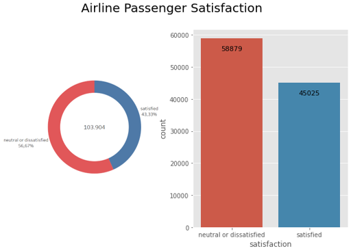

**Insight**

Lebih banyak penumpang netral atau tidak puas terhadap pelayanan sehingga maskapai perlu meningkatkan kualitas pelayanan agar tingkat kepuasan penumpang meningkat.

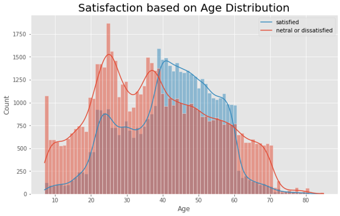

**Insight**

Segmentasi umur tersebut akan memberikan tanda bahwa maskapai perlu melakukan pendekatan atau perbaikan layanan yang lebih cocok untuk rentang umur 20-40 tahun.

**2. Faktor apa yang paling berpengaruh terhadap kepuasan dan ketidakpuasan penumpang secara keseluruhan?**

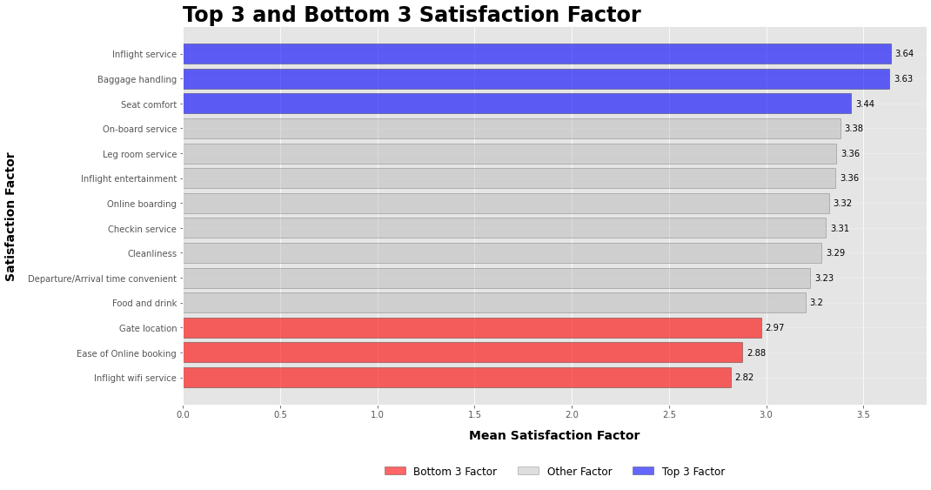

**Insight**

Dari 14 faktor yang berpengaruh terhadap kepuasan yang disurvei oleh maskapai, terdapat 3 faktor dengan penilaian pelayanan terbaik (secara berurutan dari yang terbaik), yaitu Inflight service, Baggage Handling, dan Seat comfort. Selanjutnya terdapat 3 faktor dengan penilaian pelayanan terburuk (secara berurutan dari yang terburuk), yaitu Inflight wifi service, Ease of Online booking, Gate location.

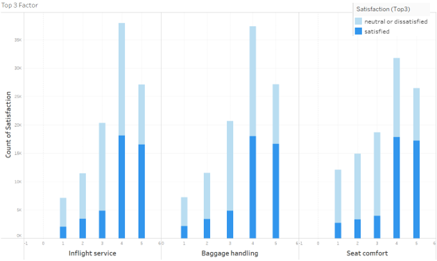
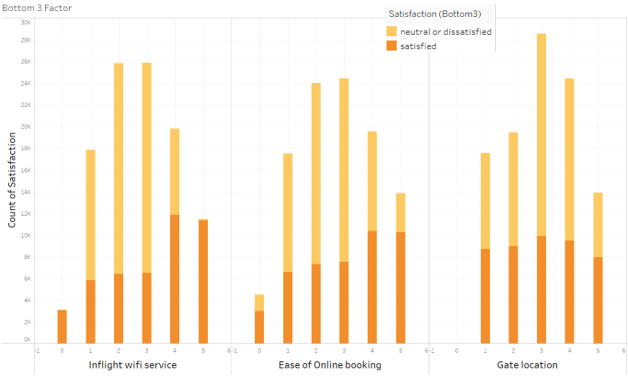

**Insight**

Untuk top 3 faktor banyak diisi oleh penumpang dengan skala 4 sedangkan bottom 3 faktor banyak diisi oleh skala 3. Maskapai perlu lebih memerhatikan 3 faktor (Inflight with service, Ease of Online booking, Gate location) dengan penilaian pelayan terburuk untuk bisa diperbaiki pelayanannya guna meningkatkan kepuasan penumpang.

**Recommendation**

Maskapai perlu lebih memerhatikan 3 faktor dengan penilaian pelayan terburuk untuk bisa diperbaiki pelayanannya guna meningkatkan kepuasan penumpang.

- Inflight wifi service : faktor ini dapat diperbaiki dengan ***meningkatkan kualitas wifi*** yang disediakan oleh maskapai.

- Ease of Online booking : faktor ini dapat diperbaiki dengan membuat ***aplikasi dengan fitur yang lebih mengikuti jaman atau up-to-date***. Atau jika memang sudah ada aplikasi online booking maka perlu dikembangkan aplikasinya sehingga lebih mudah dimengerti dan **memudahkan** penumpang dalam **online booking** maupun **online boarding** (lebih user friendly).

- Gate location : faktor **lokasi gate** dapat **diadjust** agar **tidak terlalu jauh dari pesawat** sehingga tidak memerlukan waktu dan tenaga yang lebih banyak untuk mobilisasi dari gate ke pesawat. Menambahkan **fasilitas shuttle** bus untuk lokasi gate dan pesawat yang jauh juga dapat menjadi opsi.

Note : Dalam kondisi real, untuk menentukan faktor mana yang sebaiknya ditingkatkan juga bergantung oleh cost yang dibutuhkan, misal saat menyediakan shuttle bus mungkin membutuhkan cost yang lebih banyak dibandingkan meningkatkan kualitas wifi saat penerbangan. Hal tersebut yang perlu menjadi pertimbangan maskapai untuk menentukan faktor mana yang perlu diprioritaskan dan memberikan dampak peningkatan yang signifikan.

**3. Kelas penumpang apa yang paling banyak merasa tidak puas (selain satisfied)?**

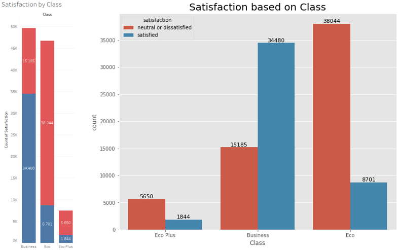
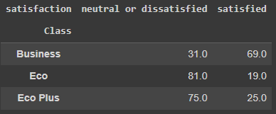

Kelas penumpang eco merupakan kelas yang paling banyak merasa tidak puas yaitu sebanyak 38.044 penumpang atau setara dengan 81% penumpang kelas eco merasa tidak puas.

**Recommendation**

Dari tabel dan visualisasi didapatkan informasi berupa segmentasi kelas pesawat yang perlu diprioritaskan untuk peningkatan adalah kelas eco, karena pengguna kelas eco adalah pengguna terbanyak setelah kelas bisnis dan penumpang paling banyak merasa netral atau tidak puas, agar dampak yang diberikan bisa berpeluang lebih banyak untuk memperbaiki kepuasan pelanggan.

**4. Bagaimana hubungan tipe penumpang dengan tingkat kepuasan penumpang? **

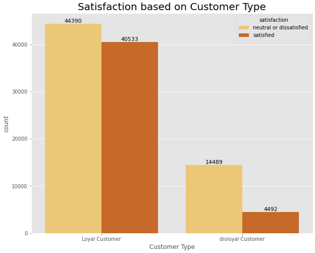
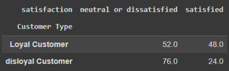
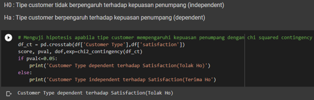

**Insight**

Dapat dilihat bahwa Loyal Customer dan Disloyal Customer, keduanya memeiliki kecenderungan menilai pelayanan berupa netral atau tidak puas. Proporsi Disloyal Customer yang memilih netral atau tidak puas cukup besar yaitu 76%. Sedangkan proporsi Loyal customer sebanyak yang merasa netral atau tidak puas adalah 52%. Dari hasil pengujian statistik dapat dipahami bahwa tipe customer mempengaruhi kepuasan penumpang.

**Recommendation**

Dapat dipahami bahwa perusahaan juga harus memperbaiki pelayanan dan mencari strategi marketing baru agar customer baru datang dan disloyal customer dapat convert menjadi loyal customer. Selain itu maskapai juga dapat mempertimbangkan pendekatan memberikan reward bagi disloyal customer untuk bisa kembali menggunakan maskapai tersebut, contoh menggunakan fitur Miles.

**5. Bagaimana hubungan keterlambatan pesawat dengan tingkat kepuasan penumpang?**

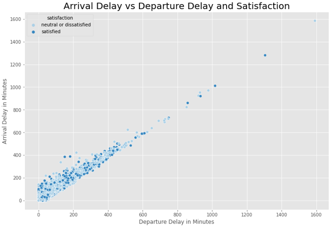

**Insight**

Waktu Keterlambatan pesawat saat kedatangan maupun keberangkatan cenderung tidak memiliki hubungan yang signifikan dengan tingkat kepuasan pelanggan. Sedangkan waktu keterlambatan kedatangan dan waktu keterlambatan keberangkatan memiliki hubungan yang cenderung linier.

**Recommendation**

Walaupun tidak ada hubungan antara waktu keterlambatan dengan kepuasan pelanggan, namun maskapai penerbangan tetap harus memberikan kompensasi pada penumpang jika melewati menit tertentu.
